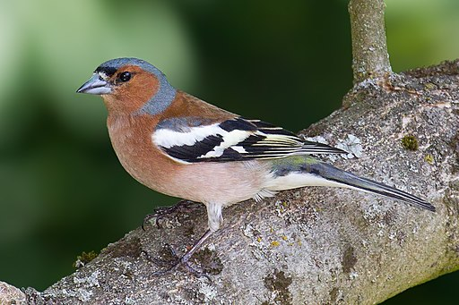

# Introduction

This workshop introduces you to Quarto [@Allaire_Quarto_2024] for
creating reproducible reports.

🎬 An instruction to do something

## Learning Outcomes

The successful student will be able to:

-   explain what Quarto and markdown are
-   appreciate the role of the YAML header
-   set default code chunk behaviour and that for individual chunks
-   use headings, simple text formatting and special characters
-   add citations and references
-   use inline code to report results in text
-   create automatically numbered tables and figures and cross reference
    them in text

## Current process

-   Typically people analyse, plot and write up in different programs.

    90% use Word/Pages/Writer/Googledocs

-   Updates to data require manual updates to all the figures and tables
    as well as to text reporting results.

-   Graphs are saved to files and inserted into the final report.

-   Reordering figures, tables and equations means updating everywhere
    they are cross-referenced.

-   Submitting to a different journal requires reformatting the
    document.

-   Manual labour ..... error prone

## What is Quarto?

-   An open-source scientific and technical publishing system that
    allows you to create dynamic reproducible reports in a variety of
    output formats.

-   Next generation RMarkdown. Many new features, greater
    standardisation and more flexibility.

    -   Markdown is a lightweight markup language for creating formatted
        text using a plain-text editor. It was designed by [John Gruber
        in 2004](https://daringfireball.net/projects/markdown/)

    -   RMarkdown is an extension of Markdown that adds support for
        embedding R code chunks in Markdown documents. It was created by
        JJ Allaire and Yihui Xie early in 2014 but has been worked on by
        many others since.

-   Mutli-language: Python, R, Julia, and Observable.

-   Include auto-numbered and cross-referencable equations, figures and
    tables

-   Integrates with Zotero

# Quarto: live demonstration

🎬 Make a copy of the `wr-chaff` repository:

```{r}
#| eval: false
usethis::use_course("3mmaRand/wr-chaff", destdir = ".")
```

```         
✔ Downloading from <https://github.com/3mmaRand/wr-chaff/zipball/HEAD>.
Downloaded: 0.73 MB  
✔ Download stored in ./3mmaRand-wr-chaff-3c34954.zip.
✔ Unpacking ZIP file into 3mmaRand-wr-chaff-3c34954/ (61 files extracted).
Shall we delete the ZIP file (3mmaRand-wr-chaff-3c34954.zip)?

1: Definitely
2: Not now
3: No way
```

🎬 Choose the option that means yes.

```         
Selection: 1
✔ Deleting 3mmaRand-wr-chaff-3c34954.zip.
✔ Opening project in RStudio.
```

## Key points from the demo

-   Quarto mixes text and code to create dynamic reports

-   The YAML header sets the default behaviour for the document and is
    between `---` at the top of the document

-   R Code chunks are between ```` ```{r} ```` and ```` ``` ```` and
    chunk options, starting `#|`, determine how/whether they run whether
    code/output is included in the rendered document

-   You can run code chunk interactively or through rendering

-   Comments: `|#`, `#` in code chunks, `<!-- in text -->` but use
    Ctrl+Shift+C

# Markdown foundations

## Text Formatting

+---------------------+---------------------+
| Markdown Syntax     | Output              |
+=====================+=====================+
| ``` markdown        | *italics*, **bold** |
| *italics*,**bold**  |                     |
| ```                 |                     |
+---------------------+---------------------+
| ``` markdown        | ***bold italics***  |
| ***bold italics *** |                     |
| ```                 |                     |
+---------------------+---------------------+
| ``` markdown        | superscript^2^      |
| superscript^2^      |                     |
| ```                 |                     |
+---------------------+---------------------+
| ``` markdown        | subscript~2~        |
| subscript~2~        |                     |
| ```                 |                     |
+---------------------+---------------------+
| ``` markdown        | ~~strikethrough~~   |
| ~~strikethrough~~   |                     |
| ```                 |                     |
+---------------------+---------------------+
| ``` markdown        | `verbatim code`     |
| `verbatim code`     |                     |
| ```                 |                     |
+---------------------+---------------------+

## Headings

+-----------------+---------------+
| Markdown Syntax | Output        |
+=================+===============+
| ``` markdown    | # Header 1    |
| # Header 1      |               |
| ```             |               |
+-----------------+---------------+
| ``` markdown    | ## Header 2   |
| ## Header 2     |               |
| ```             |               |
+-----------------+---------------+
| ``` markdown    | ### Header 3  |
| ### Header 3    |               |
| ```             |               |
+-----------------+---------------+
| ``` markdown    | #### Header 4 |
| #### Header 4   |               |
| ```             |               |
+-----------------+---------------+

### Links & Images

+-------------------------+------------------------------+
| Markdown Syntax         | Output                       |
+=========================+==============================+
| ``` markdown            | [Quarto](https://quarto.org) |
| [Quar                   |                              |
| to](https://quarto.org) |                              |
| ```                     |                              |
+-------------------------+------------------------------+
| ``` markdown            |  |
|  |                              |
| ```                     |                              |
+-------------------------+------------------------------+

## Equations

Use `$` delimiters for inline maths and `$$` delimiters for display
maths. For example:

+---------------------------+--------------------------+
| Markdown Syntax           | Output                   |
+===========================+==========================+
| ``` markdown              | inline maths: $E=mc^{2}$ |
| i                         |                          |
| nline maths: $E = mc^{2}$ |                          |
| ```                       |                          |
+---------------------------+--------------------------+
| ``` markdown              | display maths:           |
| display maths:            |                          |
|                           | $$E = mc^{2}$$           |
| $$E = mc^{2}$$            |                          |
| ```                       |                          |
+---------------------------+--------------------------+

## Divs

"Divs" are used to group content together. They can be used to apply
styling to that content.

We also use them for grouping a code chunks with text. This is useful
for creating multi-panel figures with legends.

# Create your own Quarto document

## Create a new project

🎬 File \| New Project \| New Directory \| Quarto Project

-   Browse to an appropriate place and give your project a name.

-   I used `wr-chaff`

-   Choose Engine: Knitr

-   Turn visual markdown editor off (for now)

## Change some RStudio settings

🎬 Tools \| Global Options

-   General:

    -   Turn off the three "Restore ...." options

    -   Turn "Save workspace to .RData on exit" to Never

-   R Markdown:

    -   Turn "Show output preview in:" to Viewer pane

## Your project contains

-   `wr-chaff.RProj` - what makes the folder an RStudio project

-   `_quarto.yml` - the configuration file

-   `wr-chaff.md` - the main document containing some template text

🎬 Hit Render (Ctrl-Shift-K)

Note that `wr-chaff.html` is created and opened in the Viewer pane

# Edit the YAML header

🎬 Add your name, and a title. Also add the engine and format

``` yml
---
title: "The difference in mass between subspecies of common chaffinch."
author: "Emma Rand"
engine: knitr
format:
  html
---
```

## Add some content

🎬 Add a code chunk (Ctrl-Shift-I) for a simple graph.

```{r}
#| echo: fenced
hist(rnorm(100))
```

🎬 Hit Render (Ctrl-Shift-K)

## Edit the YAML header: default code chunk options

🎬 Set some default code chunk options. I recommend these for reports

``` yml
---
title: "The difference in mass between subspecies of common chaffinch."
author: "Emma Rand"
engine: knitr
format:
  html
execute:
  echo: false
  include: true
  error: false
  message: false
  warning: false

---
```

🎬 Hit Render (Ctrl-Shift-K)

Code chunk options

-   `echo: false` code will not be included in output
-   `include: true` output will be included
-   `error: false` halt render if a code error occurs
-   `message: false` messages and warnings will not be included
-   `warning: false`

🎬 Experiment with change the options and re-rendering. Try misspelling
`rnorm` to see the error option in action.

# Adding content

🎬 Delete everything except the YAML header.

🎬 Add headings for: Introduction, Methods, Results, Discussion, and
References

🎬 Add a code chunk for - we need `tidyverse` [@tidyverse]

```{r}
#| echo: fenced
#| label: load-packages
library(tidyverse)
```

`#| label: load-packages` is a code chunk label. These are useful (here)
and essential (later) for cross-referencing.

## An Introduction

🎬 Add this test to the Introduction

> A number of subspecies of the common chaffinch, Fringilla coelebs,
> have been described based principally on the differences in the
> pattern and colour of the adult male plumage. Two of groups of these
> subspecies are the "coelebs group" that occurs in Europe and Asia and
> the "canariensis group" that occurs on the Canary Islands.

🎬 Make the species name italic

🎬 Make "common chaffinch" a link to
<https://en.wikipedia.org/wiki/Common_chaffinch>

## Data import

🎬 Make a folder called `data-raw`

🎬 Save [chaff.txt](data-raw/chaff.txt) to `data-raw`

🎬 Add a code chunk with:

```{r}
#| echo: fenced
#| label: import-data
file <- "data-raw/chaff.txt"
chaff <- read_table(file)
```

🎬 Run chunks interactively

🎬 Render

## Data summary

🎬 Add a code chunk with:

```{r}
#| echo: fenced
#| label: data-summary
chaff_summary <- chaff |> 
  group_by(subspecies) |>  
  summarise(mean = mean(mass, na.rm = TRUE),
            sd = sd(mass, na.rm = TRUE),
            n = length(mass),
            se = sd / sqrt(n))
```

🎬 Render

Notice the chunk labels being used in "Background Jobs"

## Methods text

🎬 Add this text to Methods:

> We randomly sampled 20 *F. c. coelebs* males and 20 *F. c. palmae*
> males and determined their mass with spring scales. Analysis was
> carried out with R and tidyverse packages.

It would be good not to have "hard coded" those numbers in the text.
What if we get more data. Or we just misremember or mis-type the
numbers?

# Inline code: reproducible reporting

-   Inline code is how you include a variable value, like a sample size,
    mean or statistical result, in a section of text.

-   In fact, any code output can be inserted directly into the text of a
    .qmd file using inline code.

Inline code goes between \`r\` and \` .

For example by writing:

The squareroot of 2 is \`r `sqrt(2)` \`

you will get:

The squareroot of 2 is `r sqrt(2)`

## Extract summary information for use in inline code

🎬 Add a code chunk with:

```{r}
#| echo: fenced
#| label: extract-summary
# extract values for inline reporting

# sample sizes
n_coelebs <- chaff_summary |> 
  filter(subspecies == "coelebs") |> 
  pull(n)

n_canariensis <- chaff_summary |> 
  filter(subspecies == "canariensis") |> 
  pull(n)
```

🎬 Replace the sample sizes in the Methods text with inline code

🎬 Render

# Figures

🎬 Add a code chunk to the Results section with:

```{r}
#| echo: fenced
#| label: fig-chaff
ggplot() +
  geom_point(data = chaff, aes(x = subspecies, y = mass),
             position = position_jitter(width = 0.1, height = 0),
             colour = "gray50") +
  geom_errorbar(data = chaff_summary, 
                aes(x = subspecies, ymin = mean - se, ymax = mean + se),
                width = 0.3) +
  geom_errorbar(data = chaff_summary, 
                aes(x = subspecies, ymin = mean, ymax = mean),
                width = 0.2) +
  scale_y_continuous(name = "Mass (g)", 
                     limits = c(0, 30), 
                     expand = c(0, 0)) +
  scale_x_discrete(name = "Subspecies", 
                   labels = c("Canariensis", "Coelebs")) +
  theme_classic()
```

🎬 Render

Note: It is automatically labelled as Figure 1!

## Cross referencing figures

The label of the code chunk is important when creating figures because
it is used to cross reference the figure in the text. We give cross
references with `@` followed by the label of the code chunk.

That is starts with a `fig-` prefix also matters - this is what
determines what is treated as a figure numbered in order of appearance.

🎬 Add a sentence with a cross reference to the figure:

> Canariensis have higher mass than coelebs. See \@fig-chaff.

## Figure legends

There are two ways to add a legend:

1.  Add the `fig-cap` chunk option: `fig-cap: "Mass of chaffinches"` to
    the code chunk.

2.  Use a div. `:::`

Divs are more flexible:

-   You can include inline code, citations, special characters and
    formatting

-   You can more easily make multipanel figures

## A figure legend with a div

🎬 Add a div by:

-   removing the `fig-cap` option **and** the `label` option

-   adding `:::` before and after the code chunk

-   placing the label after the opening `:::` like this:
    `:::{#fig-chaff}` Note the`#` is important for numbering

-   Putting the legend text between the code chunk and the closing `:::`

In the example figure legend I have included inline code, formatting and
a special character using inline math.

## Set the figure size and alignment

🎬 Add a chunk options `fig-width`, `fig-height` and `fig-align` to the
code chunk:

```{r}
#| echo: fenced
#| fig-width: 3.5
#| fig-height: 3.5
ggplot() +
  geom_point(data = chaff, aes(x = subspecies, y = mass),
             position = position_jitter(width = 0.1, height = 0),
             colour = "gray50") +
  geom_errorbar(data = chaff_summary, 
                aes(x = subspecies, ymin = mean - se, ymax = mean + se),
                width = 0.3) +
  geom_errorbar(data = chaff_summary, 
                aes(x = subspecies, ymin = mean, ymax = mean),
                width = 0.2) +
  scale_y_continuous(name = "Mass (g)", 
                     limits = c(0, 30), 
                     expand = c(0, 0)) +
  scale_x_discrete(name = "Subspecies", 
                   labels = c("Canariensis", "Coelebs")) +
  theme_classic()
```

# Two panel figures

-   We are going to add another figure, this time a figure with two
    panels (it's an unnecessary figure for this data, but works for
    demonstration).

-   The figure will be two histogram of the mass of each subspecies.

-   We will again use a div which will contain two code chunks, one for
    each graph.

-   There will be a label on the div for the figure as a whole and
    labels on each of the chunk to cross reference the sub figures.

-   Figure layout information will be added to the div.

## The panels

🎬 Add these two chunks to the Results section below the last figure
(make sure you're outside the last div)

```{r}
#| echo: fenced
#| label: fig-hist-canariensis
chaff |> filter(subspecies == "canariensis") |>
  ggplot(aes(x = mass)) +
  geom_histogram(bins = 8) +
  theme_minimal()
```

```{r}
#| echo: fenced
#| label: fig-hist-coelebs
chaff |> filter(subspecies == "coelebs") |>
  ggplot(aes(x = mass)) +
  geom_histogram(bins = 8) +
  theme_minimal()
```

If you render, you'll see that the two figures are added as separate
figures.

## As one figure

To make them into one figure we need to use a div.

🎬 Add the div a round those chunks

`{##fig-histograms layout-ncol=2}`

> *the two code chunks*

`:::`

🎬 Render

🛝 Add a figure legend to the two panel figure

🛝 Add a sentence with a cross reference to the figure. Can you cross
reference the sub figures?

🛝 Change the order of the figures and marvel at the updated numbers

# Tables

There are several ways to add tables to a document. We will use the
`knitr::kable()` function to create a table from a data frame or the
summary information

🎬 Add a table of the summary information for the chaffinch data:

```{r}
#| echo: fenced
#| label: tbl-chaff
chaff_summary |> 
  knitr::kable(caption = "Summary of mass(g) for the two subspecies of chaffinch.")
```

## Crossreferencing Tables

Just as the `fig-` prefix matters for corrected numbering of figures,
the `tbl-` prefix is important for the corrected numbering of figures.

Just as the label of the code chunk is important for cross referencing
of figures so it is for tables and we use `@` followed by the label of
the code chunk to cross reference the table in the text.

🎬 Add a sentence with a cross reference to the table.

## Tables - improve format

The decimal places are over-the-top. They can be set

1.  in the table by adding `digits = 2` to the `kable()` function

2.  For the document overall by adding:

```{r}
#| echo: fenced
options(digits = 2)
```

🎬 Do one of these.

## Tables - improve format

A handy tidyverse function, `str_to_sentence()`, can be used for
converting lower case to sentence case. We will do this for column names

🎬 Add `col.names = names(chaff_summary) |> str_to_sentence()` to the
`kable()` function

# The visual editor!

-   The visual editor is a WYSIWYG editor for Quarto documents. It can
    be accessed by clicking the `Visual Editor` button in the top right
    or by Ctrl-Shift-F4

-   It makes it easier to add and edit content (although I find I often
    want to use the source)

-   It is especially useful for adding citations.

-   Especially if you use zotero.

# Citations

## Package citations

You can add citations for R and packages, from doi, from a .bib file, or
from zotero.

🎬 Put your cursor where you want the citation to go and click the
`Insert` button in the top right and select `Citation` (Ctrl-Shift-F8)
and add a citation for the `tidverse` package.

🎬 Render

-   the in-text citation has been added

-   the reference has been added to the references section

-   a `references.bib` file has been created in the project folder

## Citations from DOI

🎬 Put your cursor after "plumage" in the Introduction and click the
`Insert` button in the top right and select `Citation` (Ctrl-Shift-F8).
Select From DOI and paste in 10.1016/j.ympev.2009.07.018

🎬 Render

You can also add citations to the .bib file manually. E.g. for R itself

## Extra exercises

🛝 Make a folder called `images` and save these two images of the
subspecies to it: [canariensis.jpg](images/canariensis.jpg) and
[coelebs.jpg](images/coelebs.jpg). Then add images of each of the
chaffinch subspecies as a multi-panel figure in the introduction

# Summary

-   Quarto is a Mutli-language scientific publishing system for creating
    dynamic reproducible reports in a many formats. It is based on R
    Markdown.

-   The YAML header provides metadata and sets the default behaviour for
    the document

-   Code chunk options determine how/whether they run whether
    code/output is included in the rendered document

-   Code can be run interactively

-   “Divs” are used to group content together and apply styling to that
    content.

-   Figures, images, tables and equations can be numbered automatically
    and cross referenced in text. The `fig-` and `tbl-` (etc) prefixes
    are important for this.

-   You can add citations and references.

Pages made with R [@R-core], Quarto [@Allaire_Quarto_2024], `knitr`
[@knitr1; @knitr2; @knitr3], `kableExtra` [@kableExtra]

# References
